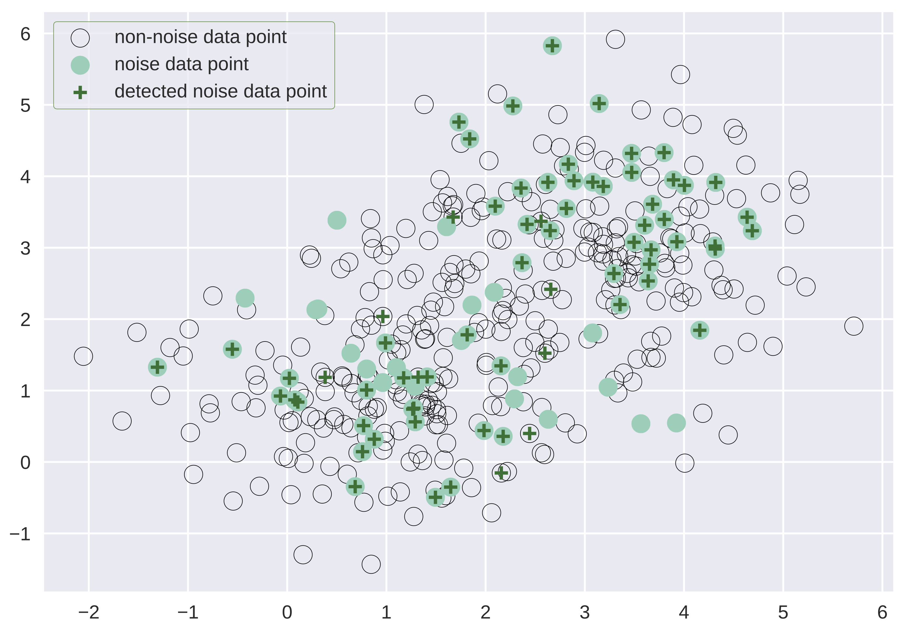

## Why care about measurement?

Measurements are relevant in data science and AI for at least two reasons:
- *Features* often are measurements on some scale, which dictates admissible statistics and operations.
  - E.g., taking the expectation assumes a linear scale.
- *Performance metrics* are also measurements, and hence the same applies. 

[This project](https://www.turing.ac.uk/research/research-projects/measurement-theory-data-science-and-ai) looked at foundational issues, of which there are many! 

### Performance measurement is easy...

If I split a data set in two or more parts, is a classifier's *accuracy* on the entire data set equal to the average* of the accuracies on the separate parts? 

Yes -- provided the parts are of equal size (e.g., cross-validation).  <!-- .element: class="fragment" -->

What about per-class recall ( = true positive rate)?  <!-- .element: class="fragment" -->

Yes -- provided the parts have the same class distribution (e.g., stratified CV). <!-- .element: class="fragment" -->

*To be precise: the arithmetic mean. 

### ...or is it?

Is a classifier's *precision* on the entire data set equal to the average of the precisions on the parts? 

**IT IS NOT!**  <!-- .element: class="fragment" -->

Unless the classifier's predictions are equally distributed over the classes on each part, which is neither likely nor under the experimenter's control.  <!-- .element: class="fragment" -->

The same applies a fortiori to F-score, which aggregates recall and precision.  <!-- .element: class="fragment" -->

### An early result: Precision-Recall-Gain curves

[Flach, P. and Kull, M., 2015. Precision-recall-gain curves: PR analysis done right. NIPS 2015.](http://people.cs.bris.ac.uk/~flach/PRGcurves)

### How we fixed it: change of scale

1. Take reciprocals:
$$
\begin{align}
prec &= TP/(TP+FP) \rightarrow 1/prec = 1+FP/TP \\\\
rec  &= TP/(TP+FN) \rightarrow 1/rec  = 1+FN/TP \\\\
\\ \\\\
\end{align}
$$
2. Clip $[1,\infty]$ to $[1,1/\pi]$ to exlude overly small values of precision/recall.
$$
\begin{align}
\\ \\\\
\end{align}
$$  <!-- .element: class="fragment" -->
3. Map $[1,1/\pi]$ back to unit interval:
$$
\begin{align}
precG &= \frac{prec-\pi}{(1-\pi)prec} = 1 - \frac{\pi}{1-\pi} FP/TP \\\\
recG  &= \frac{rec-\pi}{(1-\pi)rec} = 1 - \frac{\pi}{1-\pi} FN/TP \\\\
\end{align}
$$  <!-- .element: class="fragment" -->

### Et voila!

 <!-- .element height="35%" width="35%" -->
 <!-- .element height="35%" width="35%" -->

 - area under PRG curve $\propto$ *expected $F_1$ score*;
 - convex hull can be used to determine the *optimal operating point* for given precision-recall trade-off.

### What I will talk about

- [Scales, units, dimensions and types](#/2)
  - Perspectives from psychology, physics and computer science
- [You can't always measure what you want](#/3)
  - Latent variable models
- [Conclusions and outlook](#/4)

----

## Scales, units, dimensions and types

Perhaps surprisingly, there doesn't seem to be a definitive framework to link all these concepts together.

We'll look at it from a few perspectives:

- [Levels of measurement](#/2/1)
- [The physics perspective](#/2/6)
- [The computer science perspective](#/2/9)

## Levels of measurement

  <!-- .element height="20%" width="20%" -->
  <!-- .element height="65%" width="65%" -->

Early proposal from a psychologist [(Stevens, 1946)](https://www.jstor.org/stable/1671815), still influential although somewhat rigid and limited.

### Stevens' typology

Scale type | Description | Transformations
---|---|---
Nominal | no order, no unit | permutation
Ordinal | order, no unit | monotone
Interval | can choose unit and zero | affine
Ratio | fixed zero, can choose unit | linear

The appropriate scale type is determined by the transformation furthest down the list which is still "meaningful".

### Admissible statistics

Scale type | Statistics
---|---|---
Nominal | mode
Ordinal | median, quantile, range
Interval | arithmetic mean, variance
Ratio | geometric mean, coefficient of variation

Each scale type inherits statistics from levels above.

### Levels of measurement: discussion

1. Many statisticians challenge the rigid connection between scale types and admissible statistics.
  - E.g., Spearman's rank correlation statistic would not be admissible for ordinal data.
2. Many common scales do not fit well:
  - scales bounded from both sides;
  - scales with a fixed unit;
  - integer measurements.

Such scales abound in machine learning!  <!-- .element: class="fragment" -->

### Alternative typologies

[Mosteller and Tukey (1977)](https://books.google.co.uk/books?id=n4dYAAAAMAAJ):
*Names*,
*Grades* (e.g., beginner, intermediate, advanced),
*Ranks* (1, 2, ...),
*Counted fractions* (e.g., percentages),
*Counts* (non-negative integers),
*Amounts* (non-negative real numbers),
*Balances* (unbounded, positive or negative values).

[Chrisman (1998)](https://doi.org/10.1559/152304098782383043):
*Nominal*,
*Graded membership* (e.g., fuzzy sets),
*Ordinal*,
*Interval*,
*Log-interval*,
*Extensive ratio*,
*Cyclical ratio* (e.g., angles or time of day)
*Derived ratio*,
*Counts*,
*Absolute* (e.g., probabilities).

## The physics perspective

- Physical quantities have an associated **dimension** [(Fourier, 1822)](https://books.google.co.uk/books?id=No8IAAAAMAAJ&pg=PA128#v=onepage&q&f=false).
- In order to be compared and added or subtracted, quantities need to be *commensurable* (have the same dimension).
- Incommensurable quantities may be multiplied and divided, giving new derived dimensions.
  - E.g. pressure has dimension $M L^{-1} T^{-2}$
  - SI units Pascal = Newton/m$^2$ = kg/(m*s$^2$).

### Dimensional analysis: discussion

- Dimensions can cancel, leading to *dimensionless quantities*.
  - E.g., angle is a ratio of lengths, hence dimensionless; but it has units (radians, degrees).
  - Sometimes units also cancel, e.g. ABV has unit ml ethanol per 100 ml liquid (percentage).
- Transcendental functions ($\exp$, $\sin$ etc.) require dimensionless and *unitless* quantities.
  - E.g., $\log V$ where $V$ has dimension $L^3$ should be thought of as $\log (V/v)$ where $v$ is the unit of $V$.

### How to build on this in data science and AI?

- Both perspectives (levels of measurement and dimensional analysis) have interesting features but appear overly focused on establishing a 'true' scale type or dimension for a measurement.
  - Machine learning needs something more *flexible*.
  - In particular, a better treatment of "dimensionless" quantities which are everywhere you look!
    - relative frequencies, probabilities, evaluation metrics...

## The computer science perspective

- *Abstract data types* can be adapted to the situation.
  - provide relevant *meta-data* about measurements
  - link to useful *operations*.
- In particular, **higher-order functional languages** such as Haskell allow reasoning with and about types.
  - This provides a formal language and logic for measurement meta-data.
- The challenge is to develop a generally agreed ["Systeme international"](https://en.wikipedia.org/wiki/International_System_of_Units) of ML measurements.

### Example: Shannon entropy

[  <!-- .element height="80%" width="80%" -->](https://replit.com/@flach/ThoughtfulWarlikeRuntimelibrary)

### Example: Scoring rules

[  <!-- .element height="70%" width="70%" -->](https://replit.com/@flach/KeyBewitchedRoute)

----

## You can't always measure what you want...

- Psychologists have long understood that people's abilities (and the difficulty of a task) are *not directly observable* and need to be estimated.
  - **Item-response theory**, factor analysis
- We can adapt those *latent variable models* to machine learning, to estimate **ability** of classifiers as well as **difficulty** of instances and datasets.

### IRT from a machine learning perspective

 <!-- .element height="80%" width="80%" -->

- $\theta_i$: ability of participant $i$
- $\delta_j$, $a_j$: difficulty & discrimination of item $j$
- $x_{ij}$: binary response (correct/incorrect)

### Beta-IRT

 <!-- .element height="80%" width="80%" -->

- continuous responses $p_{ij}$
- abilities & difficulties $\in [0,1]$

### Beta-IRT: flexible Item Characteristic Curves

 <!-- .element height="80%" width="80%" -->

- discrimination $a_j$ can be negative, indicating an item that confuses high-ability participants!  <!-- .element: class="fragment" -->

### Idea 1:  Identifying noisy examples

 <!-- .element height="65%" width="65%" -->

- [Chen, Y., Prudencio, R.B., Diethe, T. and Flach, P., 2019. $\beta^3$-IRT: A New Item Response Model and its Applications. AISTATS 2019.](http://proceedings.mlr.press/v89/chen19b.html)

### Idea 2:  Adaptive testing

Use a trained IRT model to evaluate a new classifier on a small number of datasets.

1. Start with initial guess of classifier ability.
2. Choose next dataset using an *item selection criterion*.
3. Evaluate classifier and update ability estimation.
4. Repeat until stopping criterion is achieved.

### CAT results

  <!-- .element height="50%" width="50%" -->

- [Song, H. and Flach, P., 2020. Efficient and Robust Model Benchmarks with Item Response Theory and Adaptive Testing. Int J Interactive Multimedia and AI 2021.](https://ijimai.org/journal/bibcite/reference/2901)

----

## Outlook

Ultimately, empirical ML needs to make *causal* statements:

> Algorithm A outperformed algorithm B **because** the classes were highly imbalanced.

- I.e., with re-balanced classes (counterfactual intervention) the difference in performance would disappear.    <!-- .element: class="fragment" -->
  - NB. In empirical ML we can actually carry out interventions, which makes causal inference a whole lot easier!   <!-- .element: class="fragment" -->

## Concluding remarks

Proper treatment of performance evaluation in data science and AI requires a sophisticated **measurement framework** with the following components:
- *Coherent types and meta-data* for the observable performance indicators;
- *Latent-variable models* for the unobservable performance indicators of interest;
- *Causal models* to allow for counterfactual reasoning.

### Acknowledgements

Part of this work was funded through a project with the Alan Turing Institute; papers, code and videos can be accessed [here](https://www.turing.ac.uk/research/research-projects/measurement-theory-data-science-and-ai#recent-updates).

Many thanks to Hao Song, the Research Associate on the project; and collaborators Jose Hernandez-Orallo, Kacper Sokol, Meelis Kull, Tom Diethe, Yu Chen, Ricardo Prudencio, Telmo Filho, Miquel Perello-Nieto, Raul Santos-Rodriguez and many others.  <!-- .element: class="fragment" -->
